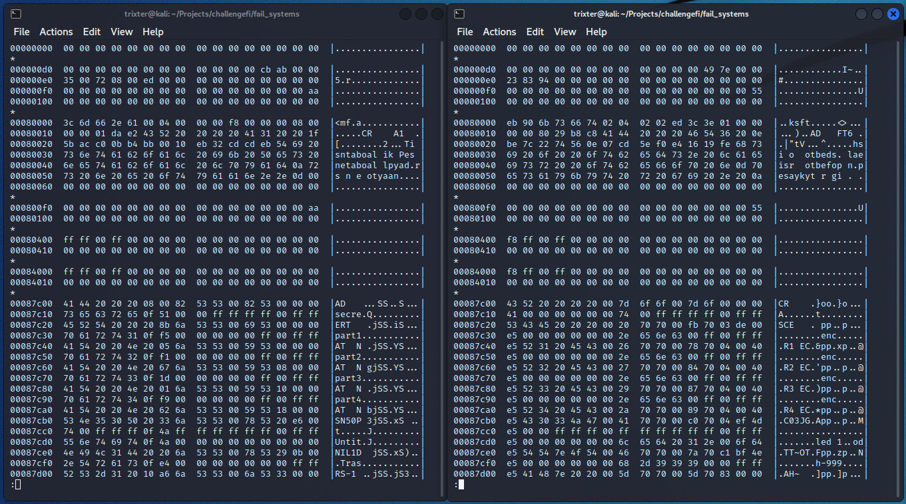
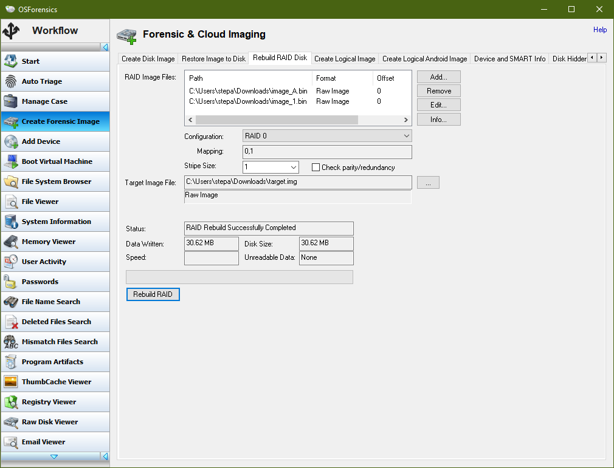
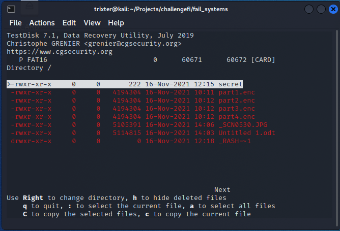

# Fail systems
```
These files somehow contain a flag. But how?
```
Attachments: `image_A.bin`, `image_1.bin`  

We're given two unknown files, so our first task is to try to identify what they are. We'll try the standard `file` and `binwalk` commands:
```bash
└─$ file image_*.bin             
image_1.bin: data
image_A.bin: data

└─$ binwalk image_*.bin

Scan Time:     2022-06-05 12:22:41
Target File:   /home/trixter/Projects/challengefi/fail_systems/image_1.bin
MD5 Checksum:  8ff5c0d56f738b2e43084fd8abf7e8cd
Signatures:    411

DECIMAL       HEXADECIMAL     DESCRIPTION
--------------------------------------------------------------------------------


Scan Time:     2022-06-05 12:22:44
Target File:   /home/trixter/Projects/challengefi/fail_systems/image_A.bin
MD5 Checksum:  99797e18b98acc42909db7d678fc975c
Signatures:    411

DECIMAL       HEXADECIMAL     DESCRIPTION
--------------------------------------------------------------------------------
1737278       0x1A823E        QEMU QCOW Image
```
Extracting the possible QCOW image (either manually with `dd` or using binwalk's `-D` flag) will eventually lead to giving "invalid version number" because there actually isn't a QCOW image and it's a false positive instead. Reading the challenge's name again will help to realize that it's word play on "File systems", which is what the two unknown files most likely are. Though neither of them are also directly mountable with `mount`.

To identify the filesystem used by both of the files, I opened them side by side with `hexdump -C [file] | less` to be able to easily spot any similarities:  

*image_1.bin on the left, image_A.bin on the right*

We can make out partial words that refer to common filenames like `secre` => `secret`, `part[1-4]`, `Untit` => `Untitled`, and `.Tras` => `.Trash`. If you compare between the two unknown files where the text gets cut off, you'll notice that it continues in the next file, and keeps changing between them, which allows us to read the start of the file saying "This is not a bootable disk." and the "mkfs.fat"/"FAT16" texts!

The only filesystem I know of that would behave like this would be RAID 0, which distributes data between all of the disks without having parity blocks/redundancy. As every second byte is in the other disk, we know that the stripe size is 1 (though this can also be just bruteforced as usually it follows 2^n/figured out for larger sizes if needed). We can also check that the two unknown files are identical in size, making it ideal for RAID.

We could rebuild the RAID array on Linux but due to being an overall headache to do by hand I just use OSForensics on Windows:  


Then we're able to confirm that we indeed got a valid disk out:
```bash
└─$ file recovered.img 
recovered.img: DOS/MBR boot sector; partition 1 : ID=0x83, start-CHS (0x35,0,35),
end-CHS (0x272,0,20), startsector 2048, 60672 sectors, extended partition table (last)
```

Then we just need to mount the recovered disk with `losetup` due to being a disk and not a specific partition, and use the `-P` flag to scan the partitions on the disk:
```bash
└─$ sudo losetup -P /dev/loop0 recovered.img
└─$ sudo fdisk -l
Disk /dev/loop0: 30.63 MiB, 32112640 bytes, 62720 sectors
Units: sectors of 1 * 512 = 512 bytes
Sector size (logical/physical): 512 bytes / 512 bytes
I/O size (minimum/optimal): 512 bytes / 512 bytes
Disklabel type: dos
Disk identifier: 0xab7ecb49

Device       Boot Start   End Sectors  Size Id Type
/dev/loop0p1       2048 62719   60672 29.6M 83 Linux

└─$ mkdir out && sudo mount /dev/loop0p1 out
```

We find a single file named `secret` inside, which is an encrypted 7-zip archive. The most obvious approach is to bruteforce the password against `rockyou.txt`:
```bash
└─$ 7z2john secret | tr -d "secret:" > secret.hash
└─$ hashcat -m 11600 secret.hash /usr/share/wordlists/rockyou.txt
```
After 3 hours of bruteforcing, we get no results so this approach is most likely wrong.

This brings us back to seeing other filenames inside the filesystem in `hexdump` in addition to `secret`, hinting at the possibility of recovering the files if they were deleted. Kali Linux has a preinstalled tool called TestDisk, which has a guide (https://www.cgsecurity.org/wiki/TestDisk:_undelete_file_for_FAT) on how to recover deleted files from FAT:  


We can recover `part[1-4].enc` files, `Untitled 1.odt` document, and a partially corrupted image _SCN0530.JPG (note that we can in theory use the thumbnail to find out the non-corrupted parts of the image):  


The document `Untitled 1.odt` requires OpenOffice, though most of document-based formats are directly openable as archives and also won't hide any data (if you tried opening the document with OpenOffice, you'd just see 10 empty pages with an image placeholder, and things could be hidden in metadata, etc.). Inside the document we can find a picture embedded named `100000000000120000000D806B359E74DED1D77D.jpg`:  


Decoding the message with `echo -n "W1NFQ1JFVF9wYXNzdzByZF0=" | base64 -d` gives us `[SECRET_passw0rd]`, allowing us to extract the encrypted 7-zip archive `secret`, which has `flag.txt` inside of it.

Flag: `GENZ{NBI-FINLAND}`